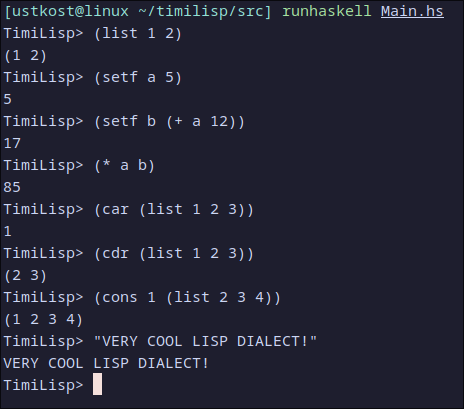

# timilisp

короче запустить это: runhaskell src/Main.hs
и там интерпретатор запустится (просьба не совершать ошибки, он ломается)
мы там сделали много чего попробуйте (ДАЖЕ ПЕРЕМЕННЫЕ ЕСТЬ!)

только не судите строго, это первая версия, но мы очень старались, правда
кстати Искандер хоть ни одного коммита не отправил, но он сформулировал то, как будут работать парсер и эвал
короче помог сильно

мы потом еще много всего сделаем наверное

тут вот картинка нашего прекрасного диалекта названного в честь тимура
()

Наш интерпретатор уже полон по Тьюрингу. Пример расчета факториала:
> (setf x (quote (cond ((> n 0) (* (+ (setf n (- n 1)) 1) (eval x))) (t 1))))
> (setf n 5)
> (eval x)
120
Юху
