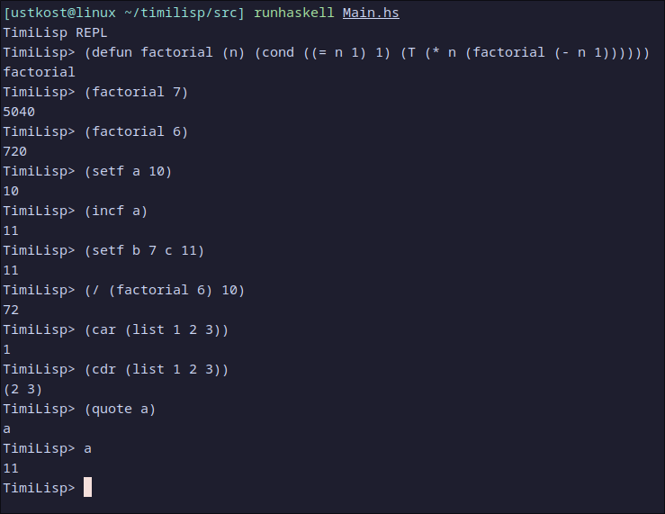

# timilisp

running:
```sh
stack build
stack run # for repl
stack run <file> # to execute file
```
for some reason running with stack does weird output in REPL so I recommend using `runhaskell` to run it:
```
cd src
runhaskell Main.hs
```

stage2 extra features:

- Timur Chumaraev: 
  ```
  implemented functions stringp, /, mod, incf, decf, strcat.
  ```

- Konstantin Ustiuzhanin:
  ```
  implemented let, print functions, changed code to support IO, added option to run code from file instead of repl, better error messages
  ```

- Iskander Kutlahmetov: 
  ```
  added support for user-defined function, rewrited eval function, added functions: defun, apply, makunbound, >=,    >, <, <=, /=, and, or, cond, append, length, equal, error, eval
  ```

supported functions list:
```
defun, apply, makunbound, +, *, -, =, >=, >, <, <=, /=, and, or, cond, setf, atom, numberp, listp, null, symbolp, qoute, list, append, car, cdr, cons, length, equal, error, eval, let, print, /, mod, incf, decf, stringp, strcat
```

we have demo program `a.tl` in the repository to demonstrate language

this is just image with random functions we support

